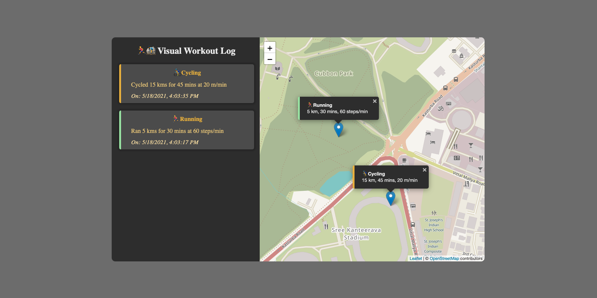

The website is deployed at: https://visualworkoutlog.netlify.app/

Click on the map to add workout details. Entered data is stored in localStorage and persists between sessions.
The app will ask permission to know your location so as to localize the map.

